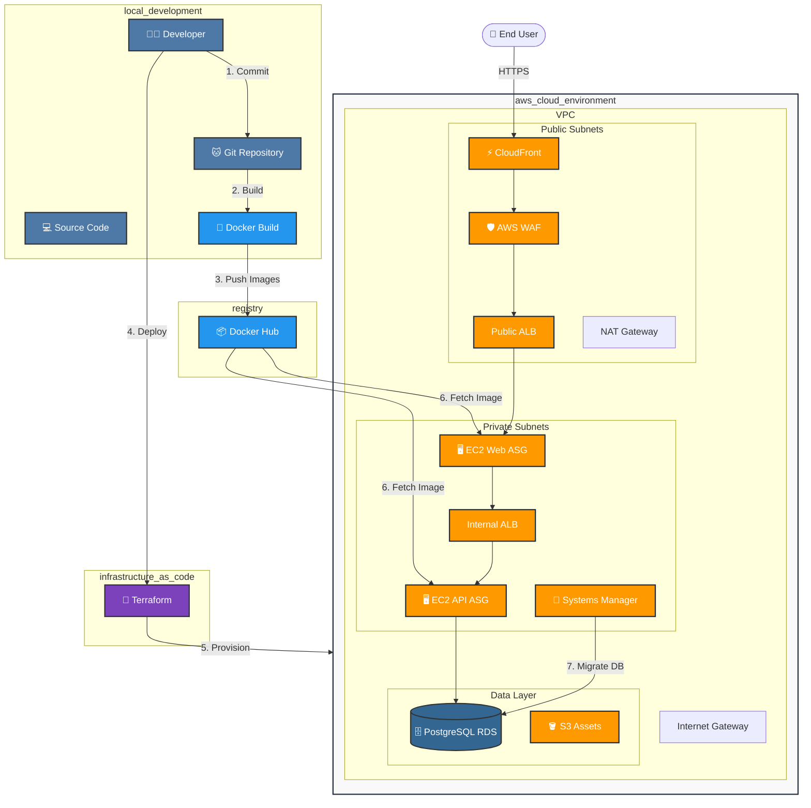

# Strada - Vehicle Market Valuation 🚗💰

**Empowering car owners with accurate, instant, and transparent vehicle valuations.**

Strada is a comprehensive platform designed to provide real-time vehicle market valuations using advanced data analysis. Beyond valuation, it offers a suite of financial tools to assist users in making informed decisions about vehicle ownership, financing, and maintenance.

---

## ✨ Features

### 📈 AI-Powered Valuation
Get instant market value estimates for vehicles based on real-time data analysis. Our system helps you understand the true worth of your vehicle in the current market.

### 💸 Financial Calculators
We provide a complete suite of tools to help you manage your vehicle finances:

*   **Loan Calculator**: Plan your finances by estimating monthly payments and total interest costs.
*   **Road Tax Calculator**: Easily calculate road tax requirements based on your vehicle's engine capacity and type.
*   **Insurance Estimator**: Get quick estimates on potential insurance premiums to avoid surprises.
*   **Affordability Calculator**: Smart tools to help you assess if a car fits comfortably within your budget.
*   **Depreciation Simulator**: Visualize reliable depreciation trends to understand long-term value retention.

### 📊 Interactive Dashboard
Experience your data through a dynamic interactive dashboard. We use advanced visualization to present market trends and analysis clearly, helping you spot opportunities and make better decisions.

### 🔐 Secure Authentication
Your data is safe with us. We bank-grade security practices and robust user management to ensure your personal information remains protected.

---

## �️ Tech Stack

Strada is built with modern, reliable technologies to ensure performance and scalability.

*   **Backend System**: Powered by **Django 5** and **Django Rest Framework**, ensuring a robust and secure API.
*   **Frontend Experience**: A responsive interface built with modern **HTML5, CSS3**, and **JavaScript**, featuring dynamic charts for data visualization.
*   **Infrastructure**: Containerized with **Docker** and hosted on **AWS (EC2 & RDS)** for high availability and reliability.
*   **Data Management**: Utilizing **PostgreSQL** for secure and efficient data storage.

---

## ☁️ Cloud Architecture

The system is deployed on AWS, leveraging Docker for containerization to ensure consistency across environments.

---

## 🚀 Getting Started

To explore the application locally or contribute to the development, please check our technical guide.

👉 **[View Developer Guide](DEVELOPMENT.md)** for installation, detailed commands, and deployment instructions.